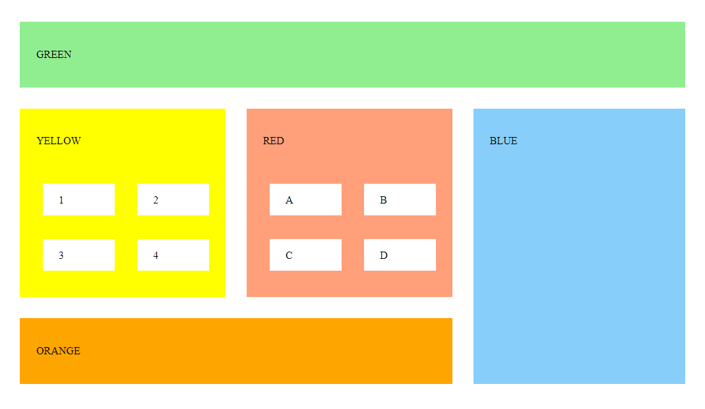

# Flexbox

The goal for this project was to match a picture of a layout with several boxes, some of them nested, using flexbox instead of a grid.
 

## Screenshot:

This is the view that matches the goal:

 

## Author:

Amie Carroll, with plenty of tips from teacher Mahendra Kumar